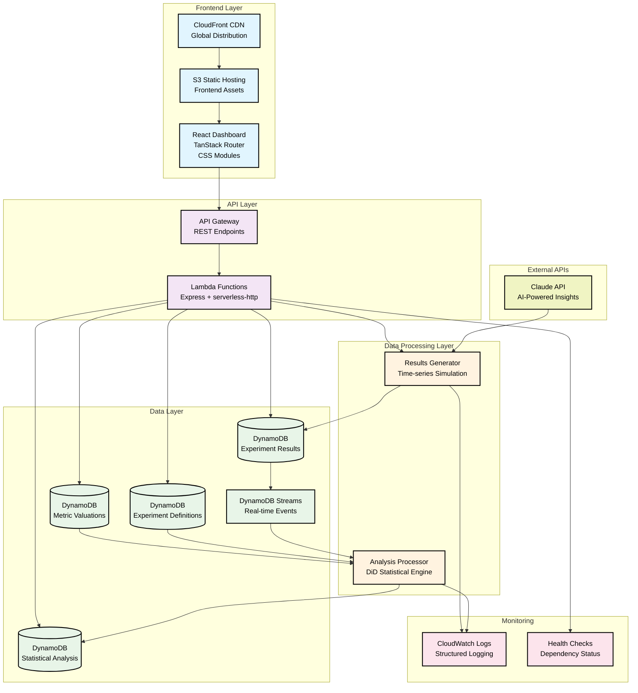

# Demo Script: Rally Economic Impact Monitoring Platform

1. Introduction (1 minute)
2. Live Demo (2 minutes)
3. Technical Architecture & Implementation (1 minute)
4. Conclusion & Why Rally (1 minute)

## 1. Introduction (1 minute)
1. Hey Alec and Oren, I'm Liam. I'm a hands-on Software Engineer with 14 years of experience and a track record of exceptional impact.
2. I'd love to work with you at Rally.
3. Instead of sending a resume, I've built a functional demo that showcases both my technical skills and the kinds of problems I can help you solve.
4. I've created an Economic Impact Reporting Platform that addresses a critical challenge faced by organizations: how do you justify UI/UX experimentation to the bottom line?
5. In a line of business where design teams struggle to prove business value, this platform enables product teams to monitor experiment performance, calculate economic impact, and demonstrate concrete ROI to stakeholders.
6. I completed this end-to-end implementation in just one day by leveraging agentic coding, demonstrating my ability to deliver at the pace needed for a high-growth startup.

## 2. Live Demo (2 minutes)

1. Live Demo
   1. Dashboard to view recent experiments
   2. Create an Experiment
   3. View the results and analysis
   4. Configure your metric values
2. Try it out CTA

## 3. Technical Architecture & Implementation (1 minute)

I focused on building a cloud-native, scalable solution that demonstrates a balance of rapid delivery capability and production engineering standards.

## 4. Conclusion & Why I'm a fit for Rally (1 minute)
1. **Why I'm a fit for Rally**:
   - I've showcased expertise in cloud-native architecture, event-driven systems, and full-stack development with modern best practices
   - I've demonstrated my ability to work through barriers, and just get something into users' hands, doing my part to shorten the feedback cycle.
   - I believe I wouldn't simply meet the bar at Rally, I will raise it

2. **Why I'm excited about Rally**:
   - I'm interested in working on products that solve real business problems with measurable impact.
   - I want to work in a high-paced environment where I can deliver extraordinary value with little red tape.
   - I believe I can accomplish my major learning goals while delivering exceptional impact on systems that real people use

3. I'm excited about the possibility of joining Rally and contributing to your mission of making great research easy.
4. Thank you for your consideration. I look forward to discussing further.