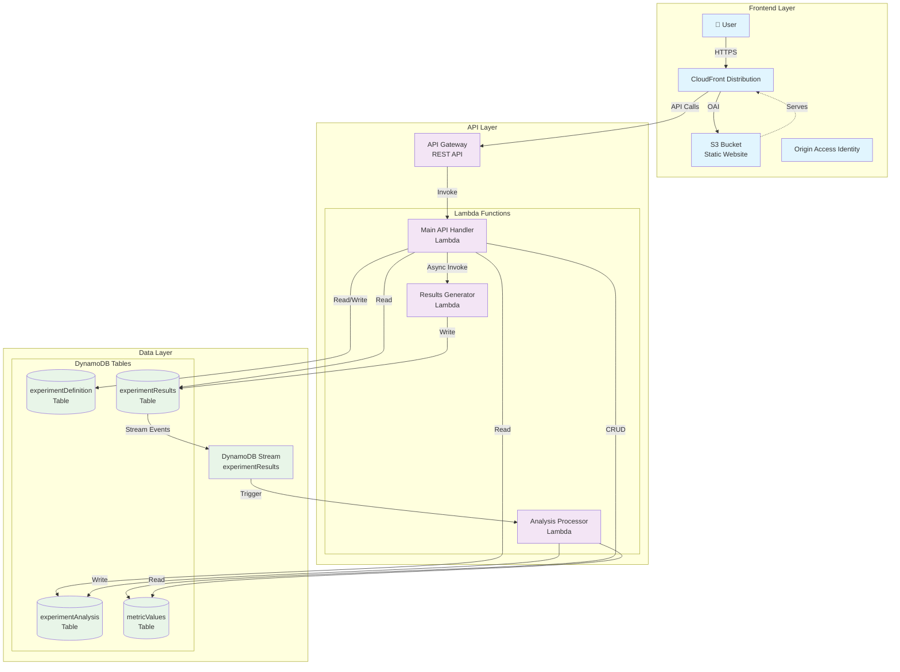
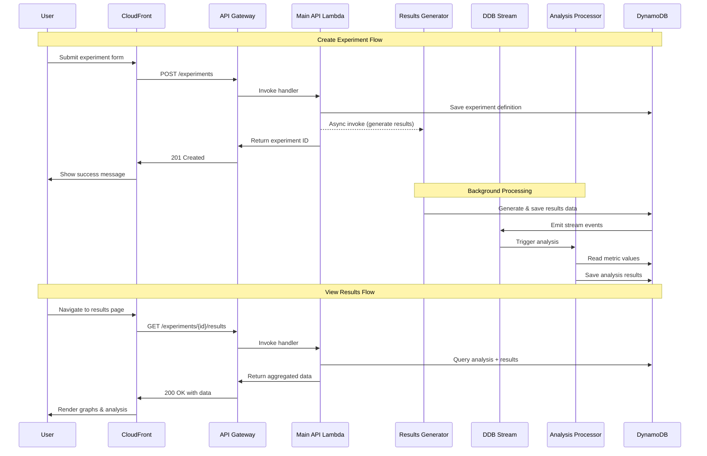

# RallyUXR Economic Impact Monitoring Application Architecture

## System Overview

```
┌─────────────────────────────────────────────────────────────────────────────────────┐
│                                 AWS Cloud                                            │
│                                                                                     │
│  ┌─────────────────────────────────────────────────────────────────────────────────┤
│  │                            Frontend (React/S3/CloudFront)                        │
│  │                                                                                 │
│  │  ┌─────────────────┐  ┌─────────────────┐  ┌─────────────────┐                 │
│  │  │  Create         │  │  Experiment     │  │  Metric Values  │                 │
│  │  │  Experiment     │  │  Dashboard      │  │  Management     │                 │
│  │  │  Page           │  │  (Results)      │  │  Page           │                 │
│  │  └─────────────────┘  └─────────────────┘  └─────────────────┘                 │
│  │                                                                                 │
│  └─────────────────────────────────────────────────────────────────────────────────┤
│                                         │                                          │
│                                    HTTPS API Calls                                 │
│                                         │                                          │
│  ┌─────────────────────────────────────────────────────────────────────────────────┤
│  │                           API Gateway                                           │
│  │                                                                                 │
│  │  ┌─────────────────┐  ┌─────────────────┐  ┌─────────────────┐                 │
│  │  │  POST /experiments │  GET /experiments │  GET/PUT          │                 │
│  │  │  GET /experiments  │  GET /experiments │  /metric-values   │                 │
│  │  │  /{id}            │  /{id}/results    │                   │                 │
│  │  └─────────────────┘  └─────────────────┘  └─────────────────┘                 │
│  │                                                                                 │
│  └─────────────────────────────────────────────────────────────────────────────────┤
│                                         │                                          │
│                                    Lambda Invocations                              │
│                                         │                                          │
│  ┌─────────────────────────────────────────────────────────────────────────────────┤
│  │                            Lambda Functions                                     │
│  │                                                                                 │
│  │  ┌─────────────────┐  ┌─────────────────┐  ┌─────────────────┐                 │
│  │  │  Main API       │  │  Experiment     │  │  Analysis       │                 │
│  │  │  Handler        │  │  Results        │  │  Processor      │                 │
│  │  │                 │  │  Generator      │  │  (DiD)          │                 │
│  │  │  - CRUD ops     │  │                 │  │                 │                 │
│  │  │  - Triggers     │  │  - Simulates    │  │  - Triggered by │                 │
│  │  │    results gen  │  │    experiment   │  │    DDB stream   │                 │
│  │  │                 │  │    data         │  │  - Performs     │                 │
│  │  │                 │  │  - Saves to     │  │    DiD analysis │                 │
│  │  │                 │  │    DynamoDB     │  │                 │                 │
│  │  └─────────────────┘  └─────────────────┘  └─────────────────┘                 │
│  │                                                                                 │
│  └─────────────────────────────────────────────────────────────────────────────────┤
│                                         │                                          │
│                                    Database Operations                              │
│                                         │                                          │
│  ┌─────────────────────────────────────────────────────────────────────────────────┤
│  │                            DynamoDB Tables                                      │
│  │                                                                                 │
│  │  ┌─────────────────┐  ┌─────────────────┐  ┌─────────────────┐                 │
│  │  │ experimentDef   │  │ experimentRes   │  │ experimentAnal  │                 │
│  │  │                 │  │                 │  │                 │                 │
│  │  │ - id (PK)       │  │ - expId (PK)    │  │ - expId (PK)    │                 │
│  │  │ - name          │  │ - metric (SK)   │  │ - analysisId    │                 │
│  │  │ - description   │  │ - timepoint     │  │ - didResults    │                 │
│  │  │ - metrics[]     │  │ - treatment     │  │ - economicImp   │                 │
│  │  │ - timeRange     │  │ - control       │  │ - metricVals    │                 │
│  │  │ - status        │  │ - value         │  │ - timestamp     │                 │
│  │  └─────────────────┘  └─────────────────┘  └─────────────────┘                 │
│  │                              │                                                 │
│  │                      DynamoDB Stream                                           │
│  │                         (triggers)                                             │
│  │                              │                                                 │
│  │  ┌─────────────────┐        │                                                 │
│  │  │ metricValues    │        │                                                 │
│  │  │                 │        │                                                 │
│  │  │ - metricId (PK) │        │                                                 │
│  │  │ - name          │        │                                                 │
│  │  │ - dollarsPerUnit│        │                                                 │
│  │  │ - description   │        │                                                 │
│  │  │ - lastUpdated   │        │                                                 │
│  │  └─────────────────┘        │                                                 │
│  │                              │                                                 │
│  │                              └─────────────────────────────────────────────────┤
│  │                                                                                 │
│  └─────────────────────────────────────────────────────────────────────────────────┘
└─────────────────────────────────────────────────────────────────────────────────────┘
```

## Data Flow

### 1. Create Experiment Flow
```
User Input → Frontend → API Gateway → Main API Lambda → experimentDefinition Table
                                                      ↓
                                            Async Invoke Results Generator Lambda
                                                      ↓
                                              experimentResults Table
                                                      ↓
                                                DynamoDB Stream
                                                      ↓
                                               Analysis Lambda
                                                      ↓
                                             experimentAnalysis Table
```

### 2. View Results Flow
```
Frontend → API Gateway → Main API Lambda → Query experimentAnalysis + experimentResults
                                                      ↓
                                              Return aggregated data
                                                      ↓
                                                Frontend renders graphs
```

### 3. Metric Values Management Flow
```
Frontend → API Gateway → Main API Lambda → metricValues Table (CRUD operations)
```

## Nx Monorepo Structure

```
packages/
├── frontend/                    # React app with TanStack Router
│   ├── src/
│   │   ├── pages/
│   │   │   ├── create-experiment/
│   │   │   ├── experiment-dashboard/
│   │   │   └── metric-values/
│   │   ├── components/
│   │   ├── services/           # API client
│   │   └── types/              # Re-export from shared
│   └── project.json
├── api-handler/                # Main API Lambda
│   ├── src/
│   │   ├── handlers/
│   │   │   ├── experiments.ts
│   │   │   ├── results.ts
│   │   │   └── metric-values.ts
│   │   ├── services/
│   │   └── utils/
│   └── project.json
├── results-generator/          # Results simulation Lambda
│   ├── src/
│   │   ├── generator.ts
│   │   └── data-simulator.ts
│   └── project.json
├── analysis-processor/         # DiD analysis Lambda
│   ├── src/
│   │   ├── processor.ts
│   │   └── did-analysis.ts
│   └── project.json
├── shared/                     # Shared types and utilities
│   ├── src/
│   │   ├── types/
│   │   │   ├── experiment.ts
│   │   │   ├── results.ts
│   │   │   ├── analysis.ts
│   │   │   └── metrics.ts
│   │   └── schemas/            # Zod schemas
│   └── project.json
└── infrastructure/             # CDK deployment
    ├── src/
    │   ├── stacks/
    │   │   ├── frontend-stack.ts
    │   │   ├── api-stack.ts
    │   │   └── database-stack.ts
    │   └── app.ts
    └── project.json
```

## Key Architectural Decisions

### 1. Event-Driven Architecture
- **DynamoDB Streams** trigger analysis processing automatically
- **Async Lambda invocation** for results generation to avoid API timeouts
- **Idempotent operations** for reliability

### 2. Data Storage Strategy
- **experimentDefinition**: Core experiment metadata
- **experimentResults**: Time-series data for each metric (treatment/control)
- **experimentAnalysis**: Computed DiD results + economic impact + snapshot of metric values
- **metricValues**: Current dollar values per unit for each metric

### 3. Frontend Architecture
- **React** with **TanStack Router** for client-side routing
- **CSS Modules** for styling (Dropbox Design-style)
- **Three main pages**: Create Experiment, View Results, Manage Metric Values
- **Prefilled experiment templates** via buttons

### 4. API Design
```
POST   /experiments              # Create new experiment
GET    /experiments              # List all experiments
GET    /experiments/{id}         # Get experiment details
GET    /experiments/{id}/results # Get experiment results + analysis
GET    /metric-values           # Get all metric values
PUT    /metric-values/{id}      # Update metric value
POST   /metric-values           # Create new metric value
```

### 5. Deployment Strategy
- **CDK** for infrastructure as code
- **NodejsFunction** for all Lambda functions
- **S3 + CloudFront + OAI** for frontend hosting
- **API Gateway** for REST API
- **Environment variables** for configuration

## Next Steps for Review

1. **Data Schema Validation**: Review the proposed table structures
2. **API Endpoints**: Confirm the REST API design meets your needs
3. **DiD Analysis**: Validate the approach for storing analysis results
4. **Frontend Pages**: Confirm the three-page structure works for your workflow
5. **Metric Value Management**: Review the approach for economic impact calculation

## AWS Components Mermaid Diagram



## Data Flow Sequence Diagram



Would you like me to elaborate on any specific aspect of this architecture or make adjustments based on your feedback?